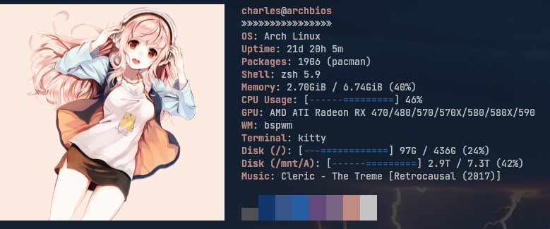

# My Dotfiles

> Doing a lot of reorganizing right now, so practically everything is subject to
> change

**OS**: Arch Linux

**Window Manager**: BSPWM + SXHKD (hotkeys)

**Bar**: Polybar

**Launcher and Menus**: Rofi

**Media**: mpc + mpd + ncmpcpp (music) and mpv + vlc (video)

**Shell**: zsh

**Terminal**: Kitty

**Browser**: Brave + qutebrowser

**Editor**: Neovim

**Email and RSS**: NeoMutt + Newsboat

**Notifications**: Dunst

**Screenshots**: Flameshot

I have a lot of scripts in the `bin` folder.

## Dependencies

Check `bin/setup/packages` for a (currently non-exhaustive, but bloated) list of
dependencies.

Some notable ones:

- `python` and `pip` for
- `xautomation`, `xdo`, and `xdotool` for a lot of BSPWM/SXHKD stuff
- `yt-dlp` for YouTube playback in mpv

## Installation

TODO

## Half-finished

- Kanata - I've been using this a lot on my Windows machine to extend keyboard
  functionality, but haven't integrated a lot of those changes on Arch
  - same for Kmonad, but I'll probably use Kanata
- Setup scripts

# Notes

- Polybar and Rofi configs will probably not be 100% since I'm rewriting
  a bunch of scripts (notably mpd/mpc/ncmpcpp and notifications stuff)
- Keybinds are everywhere, so expect to dig if you use any of the configs as is
- In places where I've removed personal info, I've tried to be diligent and list
  steps to replace it with yours but I can't guarantee it will work
